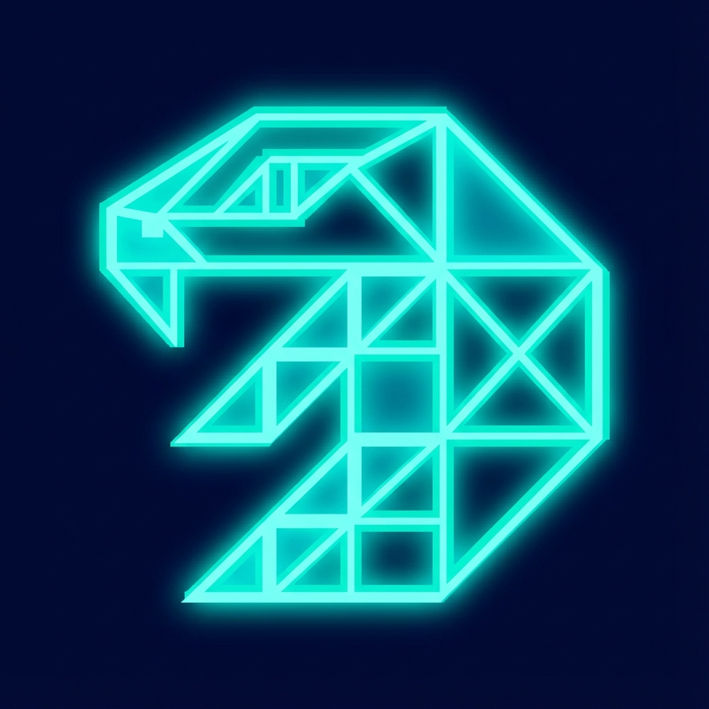

# 🐍 SNEAKER - Modern Snake Game

Un remake moderno y frenético del clásico Snake con estética synthwave/neon, mecánicas rogue-lite y efectos visuales impresionantes.



## 🎮 Características

### Movimiento Suave
- **Control 360°**: A diferencia del Snake clásico, esta serpiente se mueve suavemente en todas las direcciones
- **Sistema de Cola Dinámica**: Cada segmento sigue el camino exacto de la cabeza, permitiendo curvas naturales
- **Dash**: Acelera y vuelve temporalmente invulnerable usando la barra de energía

### Power-Ups Positivos
- 👻 **Ghost Protocol**: Atraviesa tu propia cola, muros y daña torretas
- ⏱️ **Time Warp**: Ralentiza todo el juego excepto tú (efecto Matrix)
- 🧲 **Magneto**: Atrae la comida automáticamente
- 🔫 **Turret Tail**: Tu cola dispara proyectiles azules automáticos a enemigos cercanos
- 💥 **Cut Tail**: Sacrifica el 30% de tu tamaño para crear una explosión que limpia enemigos
- 🛡️ **Shield**: Invulnerabilidad temporal

### ⚠️ Power-Ups Adversos
- ☣️ **Virus**: Invierte tus controles temporalmente
- 👁 **Blindness**: Reduce tu visión en un 60% con efecto de vignette oscura

### Enemigos
- 🔺 **Cazadores (Hunters)**: Triángulos rojos que te persiguen. 1 HP.
- 🔶 **Torretas (Turrets)**: Estructuras naranjas estáticas que disparan láseres. 3 HP. Solo aparecen desde nivel 2+.
- ☣️ **Virus**: Power-up adverso que invierte controles
- 👁 **Blindness**: Power-up adverso que reduce visión

### Progresión y Personalización
- **Sistema de Niveles**: Cada 100 puntos subes de nivel y el juego se vuelve más rápido
- **Tienda**: Compra mejoras permanentes, niveles de power-ups y boost de explosiones
- **Skins**: Múltiples apariencias con efectos únicos (Fuego, Robot, etc.)
- **Skins Secretas**: Descubre códigos secretos para desbloquear skins exclusivas
- **Misiones**: Logros que desbloquean contenido exclusivo
- **Inventario**: Visualiza y equipa tus skins desbloqueadas

## 🚀 Cómo Jugar

1. Haz clic en \"JUGAR\" en el menú principal para comenzar
2. Usa las **flechas** para maniobrar la serpiente
3. Come la comida amarilla para crecer y ganar puntos
4. Recolecta power-ups morados para obtener habilidades temporales
5. **¡CUIDADO!** Los power-ups rojos son adversos (Virus y Blindness)
6. Evita enemigos rojos y proyectiles naranjas
7. Sobrevive el mayor tiempo posible y alcanza el nivel más alto

### 🎮 Controles

**Desktop:**
- **Flechas Izquierda/Derecha**: Rotar la serpiente
- **Barra Espaciadora**: Activar Dash (acelerar + invulnerabilidad temporal)
- **ESC**: Pausar / Volver al menú
- **ESPACIO** (en Game Over): Reiniciar rápidamente

**Móvil:**
- **Joystick Virtual** (inferior izquierdo): Controlar dirección
- **Botón DASH** (inferior derecho): Activar dash
- Se activa automáticamente en dispositivos móviles

### Sistema de Niveles
- Cada comida vale **10 puntos**
- Cada **100 puntos** (10 comidas) subes un nivel
- Con cada nivel la serpiente se mueve más rápido
- A mayor nivel, más enemigos aparecen

### 🔥 HARD MODE (Nivel 10+)
Al alcanzar el **Nivel 10**, entras en HARD MODE:
- **Bonificación única**: +100 monedas al entrar
- **El nivel se queda en 10** (no sube más)
- **Puntos x1.5**: Cada comida da 15 puntos en lugar de 10
- **Monedas x2**: Cada comida da 2 monedas en lugar de 1
- **Más enemigos**: Aparecen el doble de rápido y a veces en pares
- **Mayor desafío**: Perfecta para jugadores expertos

### 💰 Bonificaciones por Nivel
- **+50 monedas** cada vez que alcanzas un nivel nuevo (récord personal)
- Ejemplo: Si tu máximo era Nivel 5 y llegas a Nivel 6, recibes 50 monedas extra

## 🛒 Tienda y Mejoras

### Mejoras de Power-Ups
Aumenta la duración de cada power-up:
- Nivel 1: Gratis (duración base)
- Nivel 2: 50 monedas (duración aumentada)
- Nivel 3: 70 monedas (duración máxima)

### Mejoras Permanentes
- **Explosion Spawner**: Hace que los power-ups de explosión aparezcan en el juego (300 monedas)
- **Shield Spawner**: Hace que los power-ups de escudo aparezcan en el juego (500 monedas)
- **Explosion Rate Boost**: Aumenta la tasa de aparición de explosiones
  - Nivel 1: +10% (200 monedas)
  - Nivel 2: +20% (200 monedas)
  - Nivel 3: +30% (200 monedas)

### Skins Comprables
- **Fuego** 🔥: 300 monedas
- **Robótica** 🤖: 300 monedas

### Skins por Misiones
- **Dorada** ✨: Alcanza nivel 10
- **Oscura** 🌑: Consigue 10,000 puntos

## 🛠️ Implementación Técnica

El proyecto utiliza una arquitectura modular organizada:

```
SNEAKER/
├── index.html          # UI y Canvas
├── styles.css          # Estilos Neon con Scroll
├── favicon.png         # Icono del juego
└── js/
    ├── main.js         # Entry Point
    ├── config.js       # Configuración Global
    ├── utils.js        # Vector2, helpers
    ├── Game.js         # Lógica Principal
    ├── entities/       
    │   ├── Snake.js    # Clase Serpiente
    │   ├── Food.js     # Comida
    │   ├── PowerUp.js  # Power-ups
    │   └── enemies/
    │       ├── Hunter.js
    │       ├── Turret.js
    │       ├── Virus.js
    │       └── Blindness.js
    └── systems/        
        ├── ParticleSystem.js
        ├── ProgressionSystem.js
        ├── SkinSystem.js
        └── ShopSystem.js
```

### Tecnologías
- **HTML5 Canvas**: Renderizado de alto rendimiento
- **ES6 Modules**: Código organizado y mantenible
- **LocalStorage**: Persistencia de datos (monedas, skins, misiones, mejoras)
- **Vanilla JS**: Sin frameworks externos
- **CSS3**: Efectos neon, animaciones y responsive design

### Características Técnicas
- Sistema de partículas para efectos visuales
- Detección de colisiones precisa (círculo, AABB)
- Game loop con delta time para movimiento consistente
- Sistema de eventos para input (teclado, touch)
- Arquitectura orientada a objetos modular
- Responsive design con soporte móvil completo

## 🎁 Secretos

Explora la tienda y descubre todos los códigos secretos... 👀
Hay más de lo que parece...

## 📝 Changelog

### Última Actualización
- ✅ Adverse Powerups: Blindness con efecto vignette
- ✅ Mejora de Tienda: Explosion Rate Boost (3 niveles)
- ✅ Menú de Pausa centrado (ESC)
- ✅ Skins Secretas: Super Alien y Muuub
- ✅ Controles Móviles táctiles completos
- ✅ Quick Reset con ESPACIO
- ✅ Sistema de HP para Torretas (3 HP)
- ✅ Gun Mechanics mejoradas (proyectiles azules visibles)
- ✅ Ghost Mode con daño a torretas
- ✅ Scroll en menús largos (Tienda, Inventario)
- ✅ Correcciones de bugs y optimizaciones

## 📜 Licencia

Proyecto de código abierto para fines educativos.

---

**¿Encontraste un bug o tienes una sugerencia?** ¡Abre un issue!

**Desarrollado con ❤️ y mucho ☕**
